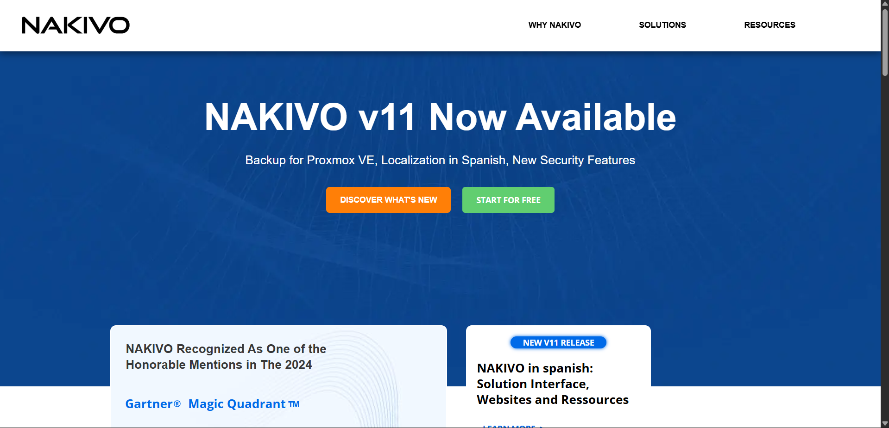
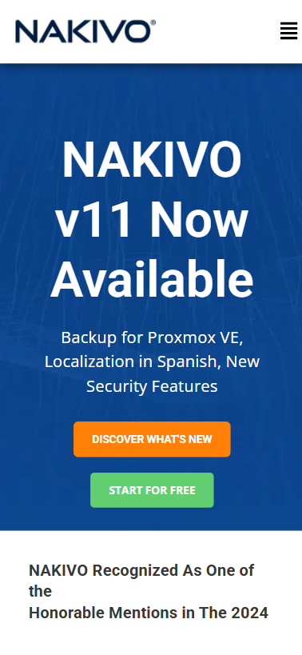
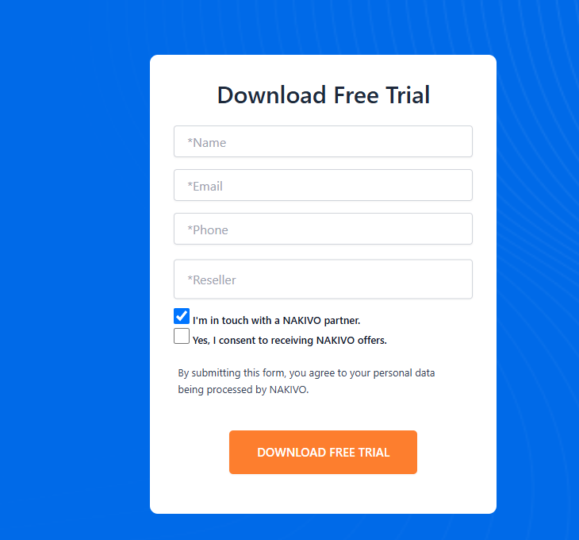

# Nakivo-Inspired WordPress Site

A modern, responsive WordPress website inspired by Nakivo.com, featuring custom PHP development, dynamic forms, and automated file downloads.

## 📋 Overview

This WordPress site demonstrates advanced customization using the Astra theme and Elementor page builder. Built with Local by Flywheel, it features a custom form system with dynamic validation and server-side file delivery.

## ✨ Features

- Custom PHP form system with shortcode integration
- Automated file downloads triggered by form submission
- Dynamic form validation with conditional fields
- Fully responsive design for all devices
- Modern UI/UX inspired by enterprise design patterns
- Conditional asset loading for optimal performance
- Reusable shortcode for easy deployment

## 🛠️ Tech Stack

**Core Technologies**
- WordPress 6.9
- PHP 8.2.27
- MySQL 8.0.35
- Nginx web server
- HTML/CSS
- JavaScript

**WordPress Components**
- Astra Theme
- Elementor Page Builder
- Ultimate Addons for Elementor
- Contact Form 7
- Image Optimizer
- Header and Footer Scripts

**Development Environment**
- Local by Flywheel
- Visual Studio Code

## 📦 Installation

### Prerequisites
- Local by Flywheel (or similar local WordPress environment)
- WordPress 6.0+
- PHP 8.0+
- MySQL 8.0+
- Astra theme

### Setup Steps

1. **Set up WordPress Environment**
   - Install Local by Flywheel
   - Create a new WordPress site
   - Configure: PHP 8.2.27, MySQL 8.0.35, Nginx
   - Start your local server

2. **Install Astra Theme**
   - Go to `Appearance > Themes > Add New`
   - Search for "Astra" and install

3. **Install Required Plugins**
   - Elementor
   - Ultimate Addons for Elementor
   - Image Optimizer

4. **Add Custom PHP Code**
   - Navigate to `Appearance > Theme File Editor`
   - Open `functions.php`
   - Copy content from `custom-functions.php` to the end of the file
   - Click "Update File"

5. **Add CSS and JavaScript Files**
```
   wp-content/themes/astra/
   ├── css/
   │   └── why-nakivo-form.css
   └── js/
       └── why-nakivo-form.js
```

6. **Set Up Downloads Folder**
```
   wp-content/themes/astra/
   └── downloads/
       └── [your-file.pdf]
```

7. **Create Page with Form**
   - Create new page with slug `why-nakivo`
   - Add shortcode: `[why-nakivo-form]`
   - Publish

## 🚀 Usage

### Form Shortcode

Add the shortcode to any page or post:
```php
[why-nakivo-form]
```

The form automatically handles styling, validation, submission, and file download.

### Customization

**Change target page:**
```php
// In custom-functions.php
if (is_page('why-nakivo')) {  // Change to your page slug
```

**Change download file:**
```php
// In custom-functions.php
$file_path = get_template_directory() . '/downloads/YOUR-FILE.pdf';
```

**Modify styling:**
- Edit `css/why-nakivo-form.css`

**Update validation logic:**
- Edit `js/why-nakivo-form.js`

## 📁 Project Structure
```
nakivo-wordpress-site/
├── README.md
├── custom-functions.php       # Custom PHP code for functions.php
├── css/
│   └── why-nakivo-form.css   # Form styling
├── js/
│   └── why-nakivo-form.js    # Form validation & behavior
├── downloads/
│   └── README.md             # Instructions for download files
└── screenshots/
    └── *.png                 # Project screenshots
```

## ⚙️ How It Works

**Form Shortcode**
- Registers `[why-nakivo-form]` shortcode
- Renders custom HTML form with dynamic fields

**Conditional Asset Loading**
- CSS and JS load only on specific pages
- Improves overall site performance

**File Download Handler**
- Processes form submissions server-side
- Sets proper HTTP headers
- Delivers files securely to users
- Works for both logged-in and guest users

## 🎨 Design

- Clean, professional interface
- Mobile-first responsive design
- Clear visual hierarchy
- Optimized user experience
- Performance-focused architecture

## 📸 Screenshots





## 🧪 Testing

Tested across:
- Chrome, Firefox, Safari
- Desktop, tablet, and mobile devices
- Form validation and submission
- File download functionality
- Responsive layouts

## 🚀 Production Deployment

1. Export from Local using migration plugin
2. Set up hosting with PHP 8.0+ and MySQL 8.0+
3. Update `wp-config.php` with new credentials
4. Configure SSL certificate
5. Implement caching plugin
6. Add security measures

## 🤝 Contributing

Contributions are welcome! 

1. Fork the repository
2. Create a feature branch
3. Commit your changes
4. Open a Pull Request

## 📄 License

Educational and portfolio project.

## 👨‍💻 Author

**Ismail El Bahloul**

## 🙏 Acknowledgments

- Design inspiration: [Nakivo.com](https://www.nakivo.com)
- Built with [Astra Theme](https://wpastra.com)
- Developed using [Local by Flywheel](https://localwp.com)

---

Built with WordPress 6.9, PHP 8.2, and modern web development practices.
